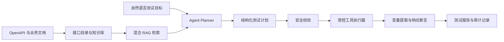

# ApiPilot

ApiPilot 是一个面向 REST API 的智能测试与诊断平台。系统结合大语言模型与混合
RAG，将自然语言测试目标转换为结构化执行计划，并通过受控工具完成接口调用、变量
传递、响应断言和报告生成。

项目采用“模型负责规划、程序负责执行”的设计：模型不能直接访问任意网络资源，
所有请求均经过接口目录校验、安全策略和审计链路。

## 核心能力

- 导入 OpenAPI 3.x 和 Swagger 2.x 接口定义
- 解析 Markdown、TXT 和 PDF 业务文档
- 结合 MySQL 全文检索与 Qdrant 向量检索，通过 RRF 融合召回结果
- 根据自然语言目标生成多步骤 API 测试计划
- 支持上下文变量、JSONPath 提取、跨步骤参数传递和六类断言
- 通过强类型工具执行检索、接口查询、HTTP 请求和报告生成
- 通过 SSE 实时推送任务状态、工具轨迹和执行结果
- 对 API Key、密码、Token、Cookie 等敏感数据进行统一脱敏
- 记录模型 Token、调用耗时、工具结果和测试报告，支持完整链路追踪

## 工作流程



## 技术栈

| 领域 | 技术 |
| --- | --- |
| 应用框架 | Java 21、Spring Boot 3.5、WebFlux |
| Agent | Spring AI、Spring AI Alibaba Agent Framework |
| 数据访问 | MyBatis-Plus、Flyway、MySQL |
| 检索 | MySQL、Qdrant、RRF |
| 基础设施 | Redis、MinIO |
| 模型协议 | OpenAI-compatible Chat API |
| 测试 | JUnit 5、Testcontainers、WireMock |

## 系统模块

```text
com.dochelper
├── agent          # 任务编排、计划生成、工具调用和事件流
├── executor       # HTTP 请求执行、变量渲染和响应断言
├── knowledge      # 文档解析、切分与知识管理
├── openapi        # OpenAPI 导入与接口目录
├── retrieval      # 混合检索、RRF 融合与评测
├── report         # 测试报告与步骤明细
├── infrastructure # MySQL、Redis、Qdrant、MinIO 适配
└── model          # 模型配置与本地回退实现
```

## 环境要求

- JDK 21
- Maven 3.9+
- MySQL 8.x
- Redis 7.x
- Qdrant 1.14.x
- MinIO

基础设施既可以通过 Docker 启动，也可以使用已有的本地或远程服务。默认连接参数见
[`.env.example`](.env.example)。

### 初始化依赖

创建 MySQL 数据库：

```sql
CREATE DATABASE dochelper
    CHARACTER SET utf8mb4
    COLLATE utf8mb4_0900_ai_ci;
```

创建名为 `dochelper-files` 的 MinIO Bucket。Qdrant Collection 和数据库表结构会在
应用启动时自动初始化。

### 配置环境变量

PowerShell 示例：

```powershell
$env:DB_URL = 'jdbc:mysql://localhost:3306/dochelper?useUnicode=true&characterEncoding=utf8&serverTimezone=Asia/Shanghai&useSSL=false&allowPublicKeyRetrieval=true'
$env:DB_USERNAME = 'dochelper'
$env:DB_PASSWORD = '<your-database-password>'

$env:REDIS_HOST = 'localhost'
$env:REDIS_PORT = '6379'

$env:QDRANT_HOST = 'localhost'
$env:QDRANT_GRPC_PORT = '6334'
$env:QDRANT_HTTP_URL = 'http://localhost:6333'

$env:MINIO_ENDPOINT = 'http://localhost:9000'
$env:MINIO_ACCESS_KEY = '<your-minio-access-key>'
$env:MINIO_SECRET_KEY = '<your-minio-secret-key>'
$env:MINIO_BUCKET = 'dochelper-files'
```

不要将真实凭据写入 `application.yml` 或提交到 Git。项目已默认忽略 `.env`。

## 启动应用

默认 Profile 为 `local,stub`。该模式使用确定性本地模型，适合验证完整业务链路，
不需要外部模型 API Key：

```powershell
mvn spring-boot:run
```

启动后访问：

- Web 控制台：`http://localhost:8080/`
- 健康检查：`http://localhost:8080/actuator/health`
- 系统概览：`http://localhost:8080/api/v1/system/overview`

## 接入 DeepSeek

通过环境变量启用 DeepSeek Profile：

```powershell
$env:AI_BASE_URL = 'https://api.deepseek.com'
$env:AI_API_KEY = '<your-deepseek-api-key>'
$env:AI_CHAT_MODEL = 'deepseek-v4-flash'
$env:SPRING_PROFILES_ACTIVE = 'local,deepseek'

mvn spring-boot:run
```

DeepSeek Chat API 用于生成结构化测试计划。由于 DeepSeek 当前未公开 Embedding API，
该 Profile 的向量生成使用本地确定性回退实现；它用于验证 RAG 工程链路，不代表真实
语义向量模型的检索效果。若需要语义 Embedding，可替换对应的 `EmbeddingModel` Bean，
检索业务层无需修改。

## 运行测试

运行单元测试：

```powershell
mvn test
```

在 MySQL、Redis、Qdrant 和 MinIO 可用时运行完整集成测试：

```powershell
mvn -Ppublic-infra-it verify
```

## 安全设计

- 接口请求必须命中已导入的 OpenAPI 目录
- 默认限制私网地址和高风险 HTTP 方法
- 危险操作需要显式确认
- 请求体、响应体、事件和报告在持久化前统一脱敏
- 模型只接收变量名称，敏感变量值在执行阶段注入
- 任务具有最大步骤数、工具调用次数、超时和取消边界

## 示例资料

- [OpenAPI 示例](src/main/resources/demo/japiserver-openapi.yaml)
- [Agent 测试规则示例](docs/demo/japiserver-agent-guide.md)
- [异常响应规则示例](docs/demo/japiserver-auth-error-guide.md)
- [业务接口规则示例](docs/demo/japiserver-dashboard-guide.md)
- [技术基线 ADR](docs/adr/0001-stage0-technology-baseline.md)

## 当前边界

- 当前版本聚焦单实例运行，尚未实现分布式任务调度
- RAG 自带评测集仅用于回归验证，不代表生产数据集效果
- DeepSeek Profile 使用本地 Embedding 回退；生产环境应接入语义向量模型
- 执行器面向 API 功能测试，不提供专业压测工具的高并发流量能力
