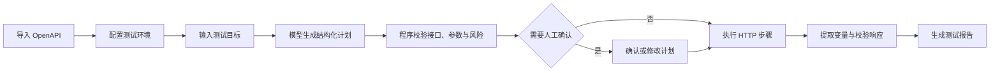

# ApiPilot

ApiPilot 是一个本地运行的 REST API 测试 Agent。导入 OpenAPI 文档、配置目标环境并输入测试目标后，系统会让大模型生成结构化执行计划，再由 Java 执行器完成接口调用、变量传递、响应断言、契约校验和报告生成。

ApiPilot 采用“模型规划、程序执行”的方式：模型只输出候选计划，不能直接发起网络请求；所有步骤都必须匹配已导入的 OpenAPI Operation，并通过目标地址、HTTP 方法、参数和风险策略校验。

> ApiPilot 当前面向本地单用户使用。请只连接你有权测试的服务，不要将控制台直接暴露到公网。

## 功能

- 导入 OpenAPI 3.x 和 Swagger 2.x 的 JSON/YAML 文档
- 根据自然语言目标生成多步骤 API 测试计划
- 按路径、业务词、读写意图和列表/详情形态筛选候选接口
- 使用 JSONPath 提取响应变量并传递给后续步骤
- 校验状态码、业务断言和 OpenAPI Schema
- 对读取请求进行有限重试，对可修复错误重新规划剩余步骤
- 在写入或删除操作执行前要求人工确认
- 通过 SSE 实时展示计划、执行轨迹和结果
- 生成终态测试报告，并支持 Markdown 与 JUnit XML 导出
- 可选导入 Markdown、TXT、PDF 业务文档，使用 MySQL 与 Qdrant 混合检索
- 对凭证、Token、Cookie、邮箱和手机号等敏感内容进行脱敏

## 运行流程



## 快速启动

### 环境要求

- Docker 24+ 与 Docker Compose v2
- 可用的 OpenAI-compatible Chat API Key

如果准备从源码运行，还需要 JDK 21、Maven 3.9+ 和 MySQL 8.x。

### 1. 准备配置

克隆仓库后复制配置模板：

```bash
cp .env.example .env
```

Windows PowerShell：

```powershell
Copy-Item .env.example .env
```

编辑 `.env`，至少填写以下变量：

```dotenv
DB_PASSWORD=<应用数据库密码>
MYSQL_ROOT_PASSWORD=<数据库管理员密码>
SECRET_STORE_MASTER_KEY=<稳定的随机主密钥>
AI_API_KEY=<模型服务 API Key>
```

`SECRET_STORE_MASTER_KEY` 用于加密运行时敏感值。首次部署后必须稳定保存；更换该值会导致已有密文无法解密。可以用下面的 PowerShell 命令生成随机值：

```powershell
[Convert]::ToBase64String([Security.Cryptography.RandomNumberGenerator]::GetBytes(32))
```

### 2. 启动核心模式

核心模式只启动 ApiPilot 与 MySQL，包含 OpenAPI 导入、Agent 规划、受控执行、契约校验和报告功能：

```bash
docker compose -f docker-compose.core.yml up --build -d
```

查看运行状态：

```bash
docker compose -f docker-compose.core.yml ps
```

启动完成后访问：

- Web 控制台：<http://localhost:28080/>
- 健康检查：<http://localhost:28080/actuator/health>

停止服务：

```bash
docker compose -f docker-compose.core.yml down
```

该命令不会删除数据库卷。需要主动清空本地数据时，再明确执行 `docker compose -f docker-compose.core.yml down -v`。

### 3. 启用业务知识库

需要导入 Markdown、TXT 或 PDF 业务文档时，先在 `.env` 中设置 MinIO 凭证，并按模型供应商要求配置 Embedding：

```dotenv
MINIO_ACCESS_KEY=<对象存储用户名>
MINIO_SECRET_KEY=<对象存储密码>
AI_EMBEDDING_MODEL=<Embedding 模型名称>
AI_EMBEDDING_BASE_URL=<可选的独立 Embedding 地址>
AI_EMBEDDING_API_KEY=<可选的独立 Embedding 密钥>
AI_EMBEDDING_DIMENSIONS=<模型要求时填写>
```

启动包含 MySQL、Qdrant 与 MinIO 的完整模式：

```bash
docker compose up --build -d
```

完整模式同样使用 <http://localhost:28080/>。两种 Compose 配置使用独立数据卷，不要同时启动。

## 使用方法

1. 在“项目”中创建一个 API 项目。
2. 为项目添加测试环境，填写被测服务的 Base URL 和允许执行的 HTTP 方法。
3. 在“OpenAPI”中上传 JSON 或 YAML 接口文档。
4. 在“Agent 实验台”中输入具体目标，例如“登录后创建一条测试记录，再查询详情并校验标题”。
5. 检查生成的步骤、参数来源和断言；计划包含写入或删除操作时，确认后才会执行。
6. 在实时轨迹中查看接口选择、变量提取、重试和校验结果。
7. 在“测试报告”中查看失败原因、步骤明细、契约结果，并按需导出报告。

建议为测试数据使用明确且可检索的标记，并为被测系统准备独立测试环境。写请求超时或连接中断时，服务端可能已经完成操作；ApiPilot 会将无法确认的结果标记为 `NEEDS_REVIEW`，此时应先到被测系统核验，不要直接重跑。

## 本地源码启动

准备 MySQL 后设置连接与模型变量：

```powershell
$env:DB_URL = 'jdbc:mysql://localhost:3306/dochelper?useUnicode=true&characterEncoding=utf8&serverTimezone=Asia/Shanghai&useSSL=false&allowPublicKeyRetrieval=true'
$env:DB_USERNAME = 'dochelper'
$env:DB_PASSWORD = '<应用数据库密码>'
$env:SECRET_STORE_MASTER_KEY = '<稳定的随机主密钥>'
$env:AI_BASE_URL = 'https://api.deepseek.com'
$env:AI_API_KEY = '<模型服务 API Key>'
$env:AI_CHAT_MODEL = 'deepseek-flash'
$env:SPRING_PROFILES_ACTIVE = 'local,deepseek,lightweight'

mvn spring-boot:run
```

应用默认监听 <http://localhost:8080/>。`lightweight` Profile 会禁用 Qdrant 与 MinIO，适合只使用 OpenAPI 的场景。

Windows 也可以从外部文件读取 API Key 并在后台启动：

```powershell
mvn package
./scripts/start-real-local.ps1 -KeyFile '<密钥文件绝对路径>' -Port 18081
```

需要知识库时，先启动 Qdrant 和 MinIO，再增加 `-WithKnowledge`。脚本将日志写入 Git 忽略的 `output/`，并使用 Windows DPAPI 保存本机主密钥。

未显式设置 Profile 时，应用使用 `local,stub`，只适合离线开发和自动化测试。

## 配置

| 变量 | 默认值 | 用途 |
| --- | --- | --- |
| `APP_PORT` | `28080` | Docker 暴露的 Web 端口 |
| `DB_URL` | 见 `.env.example` | 本地源码启动时的 MySQL JDBC 地址 |
| `DB_USERNAME` | `dochelper` | MySQL 应用账号 |
| `DB_PASSWORD` | 无 | MySQL 应用密码 |
| `MYSQL_ROOT_PASSWORD` | 无 | Docker 创建 MySQL 时的管理员密码 |
| `SECRET_STORE_MASTER_KEY` | 无 | 敏感值加密主密钥，必须稳定保存 |
| `AI_BASE_URL` | `https://api.deepseek.com` | OpenAI-compatible API 地址 |
| `AI_API_KEY` | 无 | Chat 模型密钥 |
| `AI_CHAT_MODEL` | `deepseek-flash` | Chat 模型名称 |
| `AI_EMBEDDING_MODEL` | `deterministic-local` | Embedding 模型；本地值仅用于工程调试 |
| `AI_EMBEDDING_BASE_URL` | 继承 Chat 地址 | 独立 Embedding API 地址 |
| `AI_EMBEDDING_API_KEY` | 继承 Chat 密钥 | 独立 Embedding API 密钥 |
| `AI_EMBEDDING_DIMENSIONS` | 模型默认值 | 显式指定向量维度 |
| `MINIO_ACCESS_KEY` | 无 | 完整模式的 MinIO 用户名 |
| `MINIO_SECRET_KEY` | 无 | 完整模式的 MinIO 密码 |

完整变量列表见 [`.env.example`](.env.example)。

## 安全边界

- HTTP 请求必须匹配当前项目已经导入的 OpenAPI Operation。
- 写入与删除操作需要服务端确认记录，确认信息与当前计划版本绑定。
- 自动修复只能调整剩余步骤，不能绕过接口白名单或原有断言。
- 执行器默认拒绝私网、环回、链路本地和云 Metadata 等受限目标；项目环境显式允许私网后才能访问本地测试服务。
- 运行时敏感值使用引用传递，持久化内容使用 AES-GCM 加密。
- 报告、事件和失败回放会统一脱敏，但仍应避免导入生产凭证与生产用户数据。
- 当前没有登录、多租户权限和租户级资源隔离，请只在可信本机或受控内网中使用。

## 测试

运行单元测试：

```bash
mvn test
```

运行依赖 MySQL、Qdrant 和 MinIO 的集成测试：

```bash
mvn -Ppublic-infra-it -Dit.test=com.dochelper.infrastructure.PublicInfrastructureIT verify
```

回归数据集位于 `src/test/resources/evaluation/`，覆盖接口候选选择、计划约束和安全攻击输入。测试结果只代表固定代码、数据和环境下的行为，不应当视为任意模型或任意 API 的成功率。

## 常见问题

### Compose 提示变量未设置

确认已经将 `.env.example` 复制为 `.env`，并填写所有无默认值的密码、主密钥和 API Key。占位符不能作为实际凭证使用。

### 应用无法连接 MySQL

先执行 `docker compose ps` 检查 MySQL 健康状态。源码启动时还要确认 `DB_URL` 使用宿主机地址；容器内连接使用服务名 `mysql`。

### 模型规划失败

检查 `AI_BASE_URL`、`AI_API_KEY` 和 `AI_CHAT_MODEL` 是否与供应商当前提供的 OpenAI-compatible 接口一致，并查看应用日志中的请求 ID。不要把 API Key 粘贴到 Issue 或日志中。

### 知识库页面不可用

核心模式会主动关闭知识库功能。需要该功能时使用完整 Compose，并确认 Qdrant、MinIO 以及 Embedding 配置可用。

## 技术栈

- Java 21、Spring Boot 3.5、WebFlux
- Spring AI、Spring AI Alibaba Agent Framework
- MyBatis-Plus、Flyway、MySQL 8
- Qdrant、MinIO
- JUnit 5、WireMock、Testcontainers

## License

本项目使用 [Apache License 2.0](LICENSE)。
