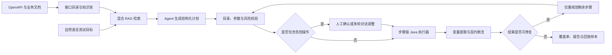

# ApiPilot

ApiPilot 是一个面向 REST API 调用链的智能测试与诊断平台。它可以导入 OpenAPI
文档和业务规则，接收自然语言测试目标，由大模型生成结构化计划，再由 Java 执行器
完成接口选择、参数传递、契约校验、失败恢复与报告生成。

项目采用“模型参与决策，程序控制执行”的边界：大模型不会直接发起网络请求；每个
HTTP 步骤都必须通过项目权限、OpenAPI 接口目录、操作风险、目标地址和敏感数据策略。

## 核心能力

- 导入 OpenAPI 3.x、Swagger 2.x，以及 Markdown、TXT、PDF 业务文档
- 使用 MySQL 与 Qdrant 进行混合检索，并通过 RRF 融合排序
- 将自然语言目标转换为多步骤 API 测试计划
- 支持 JSONPath 变量提取、跨步骤传参、响应断言和 OpenAPI Schema 契约校验
- 根据请求参数与响应字段推断接口依赖候选，生成生产者—消费者关系
- 自动生成缺参、非法枚举、错误类型等基础负向用例
- 以步骤为粒度持久化执行状态，支持幂等重试、断点恢复和失败样本回放
- 对可修复的参数或提取错误进行剩余计划重规划，并锁定已完成步骤
- 通过 SSE 推送任务状态、工具轨迹、计划 Diff 和测试结果
- 输出覆盖率指标、脱敏报告和 JUnit XML

## 安全与可靠性

- 采用开源免登录工作区模式，即开即用
- HTTP 请求必须匹配当前项目已导入的 OpenAPI Operation
- 写操作和删除操作必须使用服务端持久化的确认记录，模型字段不能替代人工确认
- 执行前拒绝环回、链路本地、云 Metadata 等受限目标，并限制危险请求头
- Token、Cookie、密码、邮箱和手机号等内容在事件、报告和回放样本中统一脱敏
- 运行时敏感值以引用流转，数据库实现使用 AES-GCM 加密
- 任务使用数据库租约领取和续约，应用重启后可以回收过期任务
- 项目可限制外部模型供应商、文档与 Schema 出站、候选接口 Top-K 和 Prompt 预算

## 工作流程



## 技术栈

| 领域 | 技术 |
| --- | --- |
| 应用框架 | Java 21、Spring Boot 3.5、WebFlux |
| Agent 与模型 | Spring AI、Spring AI Alibaba Agent Framework、OpenAI-compatible Chat / Embedding API |
| 数据访问 | MyBatis-Plus、Flyway、MySQL 8 |
| 向量与检索 | MySQL、Qdrant、RRF |
| 基础设施 | Redis、MinIO |
| 测试 | JUnit 5、WireMock、Testcontainers、Playwright |

## 主要模块

```text
com.dochelper
├── agent          # 任务编排、计划生成、多轮修改、确认、重规划、租约与事件流
├── common         # 全局通用响应、全局异常与匿名安全上下文
├── contract       # Schema 校验、负向用例、覆盖率与失败回放
├── evaluation     # 可重复质量评测记录
├── executor       # Operation 解析、HTTP 执行、变量、重试与步骤恢复
├── governance     # 项目级模型数据出站策略
├── knowledge      # 文档解析、切分与知识管理
├── openapi        # OpenAPI 导入、接口目录与依赖候选
├── project        # 项目与多环境管理
├── retrieval      # 混合检索与 RRF 融合
├── secret         # 运行时敏感值引用与加密存储
└── report         # 测试报告、步骤明细、Markdown 与 JUnit XML 导出
```

## 环境要求与快速拉起

- **JDK**: 21
- **Maven**: 3.9+
- **MySQL**: 8.x
- **Redis**: 7.x
- **Qdrant**: 1.14.x
- **MinIO**: S3 兼容对象存储

### 快速一键拉起（推荐 Docker Compose）

项目根目录提供了完整的 `docker-compose.yml`，执行一条命令即可在后台拉起全套公共基础设施并自动构建运行 ApiPilot 应用容器：

```bash
docker compose up --build -d
```

启动完成后直接访问 `http://localhost:8080/` 即可进入 Web 控制台。

> 本地裸机启动配置模板见 [`.env.example`](.env.example)。Flyway 会在应用启动时将数据库自动迁移到当前版本；Qdrant Collection 由应用初始化，MinIO 桶由初始化脚本自动就绪。

## 本地启动

先准备数据库和基础设施，再设置核心环境变量：

```powershell
$env:DB_URL = 'jdbc:mysql://localhost:3306/dochelper?useUnicode=true&characterEncoding=utf8&serverTimezone=Asia/Shanghai&useSSL=false&allowPublicKeyRetrieval=true'
$env:DB_USERNAME = 'dochelper'
$env:DB_PASSWORD = '<your-database-password>'
$env:SECRET_STORE_MASTER_KEY = '<a-stable-random-32-byte-secret>'
```

默认 Profile 为 `local,stub`，使用确定性本地规划器，不需要大模型 API Key：

```powershell
mvn spring-boot:run
```

启动后可直接访问：

- Web 控制台：`http://localhost:8080/`
- 健康检查：`http://localhost:8080/actuator/health`
- 系统概览：`http://localhost:8080/api/v1/system/overview`

> `SECRET_STORE_MASTER_KEY` 在长期运行环境中必须稳定保存。
> 未配置时应用会生成进程级临时密钥，只适合一次性本地调试；重启后已有运行时密文无法恢复。

## 接入 DeepSeek

配置 OpenAI-compatible Chat API 并切换 Profile：

```powershell
$env:AI_BASE_URL = 'https://api.deepseek.com'
$env:AI_API_KEY = '<your-api-key>'
$env:AI_CHAT_MODEL = 'deepseek-v4-flash'
$env:SPRING_PROFILES_ACTIVE = 'local,deepseek'

mvn spring-boot:run
```

DeepSeek Profile 用于生成结构化测试计划。当前 Profile 未配置独立的 Embedding
接口，向量生成保留确定性本地回退，用于验证 RAG 工程链路；生产环境可配置真实
语义 Embedding Model（如 `text-embedding-v4`）。

## 运行测试

运行单元测试：

```powershell
mvn test
```

在公共 MySQL、Redis、Qdrant 和 MinIO 已启动时运行集成测试：

```powershell
mvn -Ppublic-infra-it "-Dit.test=com.dochelper.infrastructure.PublicInfrastructureIT" failsafe:integration-test failsafe:verify
```

评测资源位于 `src/test/resources/evaluation`，包含 3 份不同规模 OpenAPI、50 条检索与
规划回归样本，以及 15 条安全攻击样本。样本数量校验和安全策略测试可以离线复现；
真实模型的任务成功率、Token 与耗时需要在固定模型版本和有效 API Key 下单独运行，
项目不把静态样本数量当作模型通过率。

当前版本全量 59 个单元测试 100% 通过；固定安全攻击集由实际策略执行并全量拦截。

## 示例资料

被测服务的 OpenAPI 与业务知识应由对应项目维护，避免 ApiPilot 仓库复制并逐渐产生过期契约。
本仓库仅保留自动化测试所需的固定夹具，以及[技术基线 ADR](docs/adr/0001-stage0-technology-baseline.md)。

## 当前边界

- 执行器面向 API 功能与契约测试，不替代 JMeter、k6 等专业压测工具
- SSRF 防护在应用层执行地址解析与网段拒绝；高安全部署仍应使用独立执行网络和出站代理，
  以消除 DNS 校验与实际连接之间的竞态窗口
- 本地 Embedding 回退不代表真实语义检索质量
- SSE 当前使用数据库增量轮询；任务规模显著增长后再评估 Redis Stream
- 质量评测结果取决于固定的数据集、模型版本和运行环境，不发布未经实际运行的成功率

## 开源许可 (License)

本项目采用 [Apache License 2.0](LICENSE) 开源许可证。
