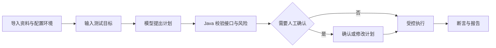

# ApiPilot

ApiPilot 是本地单用户 REST API 测试助手。导入 OpenAPI 和可选业务规则，输入自然语言目标，由模型生成计划，再由 Java 校验并执行接口调用、变量提取、响应断言和契约检查，输出可追溯报告。

模型只提出计划，不能直接发请求。写操作经过人工确认；写入结果不确定时进入 NEEDS_REVIEW，先核验远端结果，再决定下一步。项目没有登录、团队管理或多租户隔离，控制台仅适合可信本机环境。

## 功能

- OpenAPI 3 / Swagger 2 导入、版本历史和接口依赖候选。
- 多步骤测试计划、计划修改、人工确认、取消、SSE 实时进度及重启恢复。
- JSONPath 提取与跨步骤变量、响应断言、Schema 契约、Markdown 和 JUnit XML 报告。
- 按项目保存目标草稿，任务/报告搜索及游标分页；初始变量不持久化到浏览器。
- 独立配置对话与嵌入模型；业务知识库可选，支持文档检索及受控索引重建。
- 首次配置检查、失败样本列表、只读回放和结构化断言。
- 项目归档与回收站、数据统计、先预览后确认的历史清理、本机备份工具。
- Vue 3 桌面界面，浅色/深色主题。源码位于 frontend，构建后与 API 打入同一个 jar。


```mermaid
flowchart LR
    A[导入资料与配置环境] --> B[输入测试目标]
    B --> C[模型提出计划]
    C --> D[Java 校验接口与风险]
    D --> E{需要人工确认}
    E -->|是| F[确认或修改计划]
    E -->|否| G[受控执行]
    F --> G
    G --> H[断言与报告]
```

## Docker 快速启动

需要 Docker Desktop / Docker Engine 与 Compose v2。镜像构建会分别构建前端和后端，不需要宿主机安装 Node.js 或 Java。

1. 在仓库根目录复制模板，填写数据库密码、稳定主密钥与模型密钥。模板没有真实凭据。

   ```powershell
   Copy-Item .env.example .env
   ```

   Linux/macOS 使用 `cp .env.example .env`。至少填写 DB_PASSWORD、MYSQL_ROOT_PASSWORD、SECRET_STORE_MASTER_KEY、AI_API_KEY。主密钥用于加密配置和运行数据，部署后保持不变；PowerShell 可用 `[Convert]::ToBase64String([Security.Cryptography.RandomNumberGenerator]::GetBytes(32))` 生成。

2. 启动核心模式，只运行应用和 MySQL，关闭业务知识库。

   ```bash
   docker compose -f docker-compose.core.yml up --build -d
   docker compose -f docker-compose.core.yml ps
   ```

3. 浏览器访问 http://localhost:28080/，健康检查 http://localhost:28080/actuator/health。查看日志或停止：

   ```bash
   docker compose -f docker-compose.core.yml logs -f app
   docker compose -f docker-compose.core.yml down
   ```

   down 保留数据卷。Ctrl+C 退出日志查看，不停止应用。不要在共享开发设施中删除卷。

4. 需要知识库时填写 MINIO_ACCESS_KEY/MINIO_SECRET_KEY，停止核心模式后启动完整配置：

   ```bash
   docker compose -f docker-compose.core.yml down
   docker compose up --build -d
   docker compose ps
   docker compose logs -f apipilot-app
   ```

   两套 Compose 数据卷独立，不会自动迁移数据，不能同时启动。完整模式包含 MySQL、Qdrant、MinIO。在知识库界面配置供应商支持的独立嵌入模型和 Key，再受控重建；默认开发向量只验证流程，不能代表真实语义质量。

## 本地源码启动

需要 JDK 21、Maven 3.9+、Node.js 22 和 MySQL 8.x；Full 模式另需 Qdrant / MinIO。设置本机 DB_USERNAME/DB_PASSWORD 等环境变量，独立配置参考 .env.example。Windows 脚本不会自动加载仓库 .env；可选读取相邻 dev-infra 的 DocHelper 专用凭据。

在仓库根目录运行：

```powershell
.\scripts\app.ps1 start -Mode Core -Build
```

访问 http://127.0.0.1:18081/。首次缺少产物自动构建，源码改变后先 stop 再 start -Build。Full 模式使用 `-Mode Full`，需要对应设施已启动。对话模型可在界面设置；稳定主密钥默认按当前 Windows 用户 DPAPI 保存，不提交到 Git。

```powershell
.\scripts\app.ps1 status
.\scripts\app.ps1 logs
.\scripts\app.ps1 logs -NoFollow -Tail 200
.\scripts\app.ps1 stop
```

跨平台手动构建时先构建前端，再打包后端：

```bash
cd frontend
npm ci
npm run build
cd ..
mvn clean package
java -jar target/dochelper-0.0.1-SNAPSHOT.jar --spring.profiles.active=local,stub,lightweight
```

默认端口为 8080。配置真实模型和稳定主密钥后，可在同一应用中使用真实 API；stub 是开发回退，不是语义模型。IDEA Run 仍适合后端开发，前端热更新见 [前端说明](frontend/README.md)。

## 使用与维护

创建项目和环境 → 导入 OpenAPI → 查看工作台配置检查 → 填写目标 → 检查/确认计划 → 查看实际步骤及报告。访问本地被测服务需要在环境中明确允许私网，HTTP 方法与接口目录也必须匹配。

对话模型与嵌入模型独立；连接测试可能收费，索引重建会发送已索引业务切片，需要明确确认。NEEDS_REVIEW 不提供盲目重放。只读回放也会实际访问目标服务，目标变化后结果可能不同。

历史清理先预览、再输入项目编码，保留进行中和待核验任务；移入回收站只隐藏项目，不释放全部空间。备份包含 SQL、原始对象和加密主密钥，向量由文档重建。

- [日常运行、日志、备份与恢复](docs/personal-operations.md)
- [接口契约与字段](docs/api.md)
- [贡献与开发约定](CONTRIBUTING.md)
- [合成联调目标与复测](frontend/tests/integration/README.md)

## 验证

```bash
mvn test
cd frontend
npm ci
npm test
npm run build
```

单元测试不依赖收费模型。涉及真实供应商和目标服务的联调单独执行，合成数据不作为一般模型质量证据。需要公共设施的集成测试可显式运行：

```bash
mvn -Ppublic-infra-it -Dit.test=com.dochelper.infrastructure.PublicInfrastructureIT verify
```

## 配置与常见问题

完整环境变量见 [.env.example](.env.example)。不要提交 .env、API Key、数据库密码、DPAPI 文件、备份、运行日志或真实业务资料。Flyway 负责结构迁移，已有数据库升级前保留备份。

- 启动连接失败：确认设施健康、DB_URL 与账号正确；宿主机用 localhost，Compose 用服务名。
- 端口冲突：使用 `app.ps1 start -Port 18082` 或改 APP_PORT，脚本不停止未知进程。
- 模型规划失败：检查界面配置、项目资料策略与服务商兼容协议，保留错误码/requestId 定位；不要上传 Key 到 Issue。
- 知识库未启用：切换 Full，确认 Qdrant/MinIO 和独立嵌入配置，恢复备份后显式重建。
- PowerShell 不允许运行脚本：检查当前会话执行策略，可在本会话设置 `Set-ExecutionPolicy -Scope Process Bypass`；无需修改 UAC。

## 技术栈

Java 21 / Spring Boot 3.5 / WebFlux / Spring AI / Spring AI Alibaba、MyBatis-Plus / Flyway / MySQL、Qdrant / MinIO、Vue 3 / Vite / TailwindCSS、JUnit 5 / WireMock / Testcontainers。

## License

[Apache License 2.0](LICENSE)。
